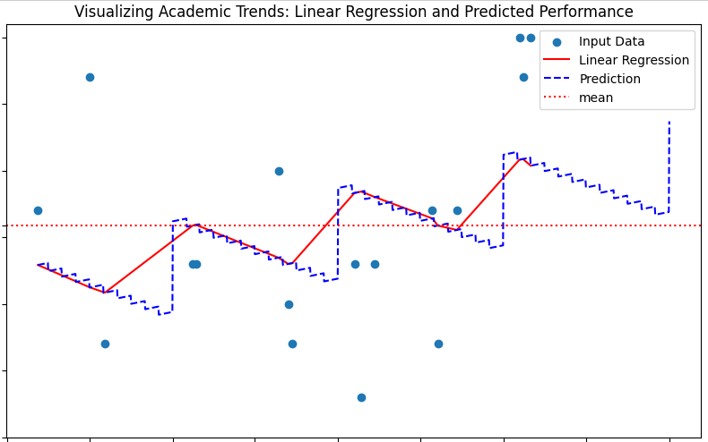

# Motivation

In my journey to explore the realm of data science, I embarked on a project aimed at mastering key modules such as Matplotlib, scikit-learn, and Pandas. Through this project, I endeavored to develop not only technical proficiency but also the ability to craft compelling narratives from data.

With this in mind, I got acquainted with the modules through the following task. I took on the task of plotting how my academic performance has evolved, leveraging data visualization techniques to enable meaningful comparisons. I also sought to create a model that can "predict" what my academic performance will be in the future. As this was my first time seriously working with these modules, I used a straightforward linear regression model for this purpose. I would like to clarify that this model was created to "have a little fun" and was not meant as a "serious model". For a meaningful model, one would need to divide the data into test (20% is the industry standard) and training (80%) sets and evaluate the model afterward. I will attempt this in the future on another dataset with better explanatory variables. Overall, I achieved my goal of getting acquainted with the modules and telling a story using data.

## Dependencies

As of writing this, I have not provided a test pdf to use this notebook with, but I plan on doing so in the future.

If you are an RWTH student and would like to use this notebook for your grades, you can readily do so. Simply download your report card "Notenspiegel(Alles)" and save it in the same folder as this file under "Notenspiegel.pdf" (Alternatively you can edit the file_path variable to the path of the document in the first code block).

### Other dependencies

This notebook uses the following. Please ensure you have Python and Java installed. When writing the execution instructions, I used VS code when writing down the execution instructions, so if you are not familiar with venvs kindly download it, it provides a very easy way to create them without having to use the command line.

The remaining dependencies will be automatically installed when you create the venv.

- [Python](https://www.python.org/) (version 3.12.2 or later)
- [Java](https://www.java.com/) (version 11.0.13 or later)
- [Pandas](https://pandas.pydata.org/) (version 2.2.1 or later)
- [Matplotlib](https://matplotlib.org/) (version 3.8.0 or later)
- [scikit-learn](https://scikit-learn.org/stable/) (version 1.3.0 or later)
- [tabula-py](https://github.com/chezou/tabula-py) (version 2.7.0 or later)
- [Ipython Kernel](https://ipython.org/) (version 6.29.3 or later)
- [jpype](https://github.com/jpype-project/jpype) (version 1.5.0 or later)

## Setting up a venv (in VS Code)

At this point, you should have already installed Python and Java. Restart VS Code before proceeding (if you have already opened it).

### What is a venv (Virtual environment)?

Virtual environments are lightweight environments existing on top of the base Python installation, allowing different sets of packages to be installed in different directories. Why is this useful? Assume you have a module that you use in some code that you wrote. It happens to be deprecated, but you haven't gotten around to updating your code. If you were to run this notebook, it may upgrade said dependency to a newer version and thus cause your code to break. By using venvs the required packages remain isolated from each other. 

While writing this, I used a conda environment, which is an analogous environment that is handled by the anaconda environment and package manager. Since it would be another required install and it is not necessary, I listed the instructions for configuring a venv instead.

### Creating a venv 

Open VS Code and navigate to the folder that contains this file, in this folder, also include the requirements.txt document. When you open the folder in VS Code, you will need to select a kernel as to run this notebook. Click  "Select kernel" and then "Select another kernel". Create a new Python environment, a venv, with Python 3.12 as the interpreter. Select requirements.txt and then click OK when it asks you which dependencies to install. Once the venv is created, you are ready to roll. Restart VS Code and everything should work from here on out.
